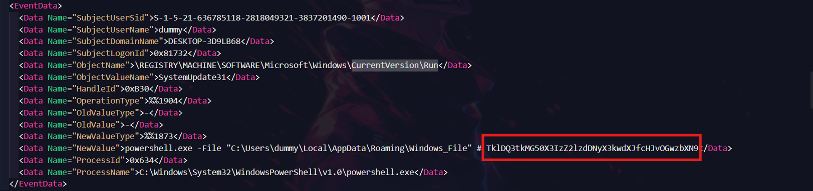
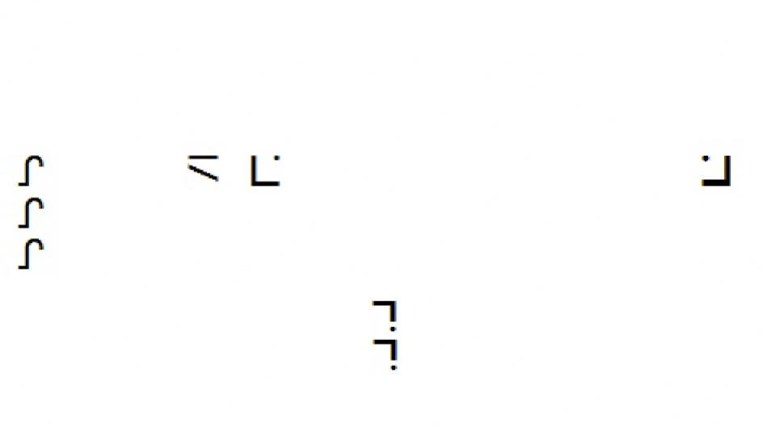

# Spooky CTF

**Forensic**

**Key Detail**

<aside>
💡

*One of the NICC members has recently been reporting abnormal activity on their work device. After lending the device to a friend, the user noticed a new pop-up opening briefly at startup. Given this log capture from this device, find the key information that will stop them from registering this problem with the higher-ups.*

</aside>

For this challenge we were given a Windows `.evtx` file. I used `evtx_dump` to convert it to XML, and dug around. Honestly, I didn’t find anything interesting for a while. But eventually we got a hint: “Research Persistence Methods on Windows Machines”.

Armed with this information, I found a suspicious looking update to the `CurrentVersion\Run` registry key:



Decoding the base64 value got the flag `TklDQ3tkMG50X3IzZ2lzdDNyX3kwdXJfcHJvOGwzbXN9`

`NICC{d0nt_r3gist3r_y0ur_pro8l3ms}`

**Doom Decryption**

<aside>
💡

*A mad scientist who calls himself Dr. DOOMIX has a plan to take over the world. He’s hiding a secret message in one of his strange songs. If people hear it, they fall under his control.*

*Your job is to stop him.*

*We got a copy of the song. Somewhere in it is a hidden message, a code that starts the mind control. If you can find and decrypt it, you can shut down his plan before it’s too late.*

*He’s tricky. He hides clues in sounds and patterns. Listen closely. Look deep.*

*This flag only contains uppercase characters*

</aside>

We are given an audio file, throw it into Audacity and change the view to spectrogram. Zooming in a little gives us the flag


`NICC{DOOMSDAY1993}`

**The Magicians Ring**

<aside>
💡

*Your friend Bobby lost his wife’s wedding ring to a magician wearing a red hat during a game of poker and he really needs your help! The magician has sealed the ring in a folder with a magic spell only a true sorcerer could know. Luckily, Bobby has identified the rune symbols used by the magician in his cryptic blog post about spells on his LinkedIn. Can you conjure the secret spell and defeat the red hat magician to give Bobby’s wife back her ring?*

*Good luck! And P.S. — Don’t bother opening the folder if you don’t have the secret spell.*

*Hint: The magician was also an avid archaeologist. He discovered a fossil that sits 11.5-feet tall and 27-feet long that was bought by the Museum of Natural History.*

</aside>



Initially I tried reverse image search, and threw both files into cyberchef, but upon learning about the stego I dug through my old notes to find a popular website I’ve used before. [Hacktricks](https://book.hacktricks.wiki/en/index.html) has a great list of common steganography techniques and even links to online solvers. I skimmed through and found the one I had used before which is `Steganographic Decoder`

[Steganographic Decoder](https://futureboy.us/stegano/decinput.html)

Sure enough it extracted a password: `ooglygoo`


Unzipping the archive revealed a short video with the flag. I was suspicious when I saw flag{} rather than NICC. Sure enough it was actually.

`NICC{i_figured_it_out}`

**NuClear Listeners**

<aside>
💡

*A NICC member was quickly configuring a VM used for light web hosting development. Recently, the machine has been doing weird activity, and appears to have been compromised! Given this forensics image, find evidence of initial access, persistence mechanisms, and recon activity performed against this device.*

</aside>

We have an E01 file `NuClear_Listeners.E01`

FTK Imager will be the tool that accompanies us in this challenge.

**Part 1**

The first thing I'll be always looking at are of course: Logs. Logs for httpd are located in `/var/log/apache2`


We clearly see that someone tried to enumerate the apache2 content with ffuf or gobuster kind of tool. I'm not a 100% sure about this but the first part of the flag have been injected as the "User-Agent” 

Decode base64: `TklDQ3tyM2Nvbl8=`  ⇒ `NICC{r3con_`

**Part 2**

Lets take a look at our user, Always looking at the file that are loaded with user sessions just to name a few

<aside>
💡

- /etc/profile
- /etc/profile.d/*.sh
- ~/.profile
- ~/.bash_profile
- ~/.bash_login
- ~/.bashrc
- /etc/bash.bashrc
- /etc/environment
- ~/.xinitrc
- ~/.xsession
- /etc/X11/Xsession
- /etc/X11/Xsession.d/*
- ~/.config/autostart/*.desktop
- /etc/xdg/autostart/*.desktop
- ~/.config/systemd/user/*.service
- /etc/systemd/user/*.service
- /etc/systemd/system/*.service
- ~/.config/upstart/*.conf
- /etc/init/*.conf
- ~/.bash_logout
- /etc/skel/*
- ~/.zprofile
- ~/.zshrc
- /etc/zsh/zprofile
- /etc/zsh/zshrc
</aside>

Looking at `/home/spooky/.bashrc` 


Explanation: This command launches `nc` to open a `TCP connection to IP 10.0.2.4 on port 1234` and ties that connection to a `shell (/bin/bash)` so that remote input is executed on the host. Standard error is redirected to `/dev/null` to hide error messages, and the `trailing &` puts the process into the background. In short, it attempts to create a backgrounded reverse shell from the host to 10.0.2.4:1234

Decode base64: `YW5kX3AzcnMxc3QzbmNlXyAgICgyKQ==` ⇒ `and_p3rs1st3nce_   (2)`

**Part 3**

As nothing else came out of interest from the user file, the next thing I like to verify is `crond` and
`systemd service`
So I will take a look at these

<aside>
💡

- /etc/crontab
- /etc/cron.d/ (fichiers de jobs système, ex. /etc/cron.d/myjob)
- /etc/cron.hourly/
- /etc/cron.daily/
- /etc/cron.weekly/
- /etc/cron.monthly/
- /var/spool/cron/crontabs/
- /var/spool/cron/
- /etc/cron.allow
- /etc/cron.deny
- /etc/anacrontab
- /etc/systemd/system/*.timer
- /usr/lib/systemd/system/*.timer
- ~/.config/systemd/user/*.timer
</aside>

Farily quickly `/var/spool/cron/root` yield


This cron entry runs `every minute` and attempts to `open a TCP connection to 10.0.2.4:1234 with nc`, handing an `interactive /bin/sh` to the remote host.

Decode base64: `YzBtZTJfaW5fICAoMyk=` ⇒ `c0me2_in_  (3)`

**Part 4**

Finally I found the last part early as I always take a peek for user in `/etc/passwd` pretty early in the analysis

Also note that nginxwebservice user was VERY suspicious as apache2 httpd is installed and they usually serve the same purpose

`nginxwebservice:x:1001:1001:NGINX WEB CLIENT bUBueV9mbEB2b3JzfSAgICg0KQ==:/home/nginxwebservice:/bin/bash`


Decode base64: `bUBueV9mbEB2b3JzfSAgICg0KQ==` ⇒ `m@ny_fl@vors} (4)`

Putting them all together completes the flag: `NICC{r3con_and_p3rs1st3nce_c0me2_in_m@ny_fl@vors}`

**Final Transmission**

<aside>
💡

*A corrupted transmission has been recovered from a dying network node. Your task is to extract and analyze the recovered disk image to uncover what the Helios Ark tried to preserve. Somewhere inside lies the truth of this world.*

</aside>

We were given the following files:
Client.txt:

```
src 10.0.0.3 dst 10.0.0.2
	proto esp spi 0x00000101 reqid 0 mode transport
	replay-window 0
	auth-trunc hmac(sha256) 0x31313232333334343535363637373838393930306161626263636464656566663030313132323333343435353636373738383939616162626363646465656666 96
	enc cbc(aes) 0x3030313132323333343435353636373738383939616162626363646465656666
	lastused 2025-10-12 17:06:40
	anti-replay context: seq 0x0, oseq 0x0, bitmap 0x00000000
	sel src 0.0.0.0/0 dst 0.0.0.0/0
src 10.0.0.2 dst 10.0.0.3
	proto esp spi 0x00000100 reqid 0 mode transport
	replay-window 0
	auth-trunc hmac(sha256) 0x31313232333334343535363637373838393930306161626263636464656566663030313132323333343435353636373738383939616162626363646465656666 96
	enc cbc(aes) 0x3030313132323333343435353636373738383939616162626363646465656666
	lastused 2025-10-12 17:06:40
	anti-replay context: seq 0x0, oseq 0x13c, bitmap 0x00000000
	sel src 0.0.0.0/0 dst 0.0.0.0/0
```

Server.txt:

```
src 10.0.0.2 dst 10.0.0.3
	proto esp spi 0x00000100 reqid 0 mode transport
	replay-window 0
	auth-trunc hmac(sha256) 0x31313232333334343535363637373838393930306161626263636464656566663030313132323333343435353636373738383939616162626363646465656666 96
	enc cbc(aes) 0x3030313132323333343435353636373738383939616162626363646465656666
	lastused 2025-10-12 17:06:40
	anti-replay context: seq 0x0, oseq 0x0, bitmap 0x00000000
	sel src 0.0.0.0/0 dst 0.0.0.0/0
src 10.0.0.3 dst 10.0.0.2
	proto esp spi 0x00000101 reqid 0 mode transport
	replay-window 0
	auth-trunc hmac(sha256) 0x31313232333334343535363637373838393930306161626263636464656566663030313132323333343435353636373738383939616162626363646465656666 96
	enc cbc(aes) 0x3030313132323333343435353636373738383939616162626363646465656666
	lastused 2025-10-12 17:06:40
	anti-replay context: seq 0x0, oseq 0x389, bitmap 0x00000000
	sel src 0.0.0.0/0 dst 0.0.0.0/0
```

sslkeys.logs:

```
# TLS secrets log file, generated by OpenSSL / Python
SERVER_HANDSHAKE_TRAFFIC_SECRET 204d0530cdf1d77b7eb2fb7dd7ed9a270103ca35d260ad1c5024d02dfcd8db4c 8613926ddf6ca3aeb59b76cf398033e36e3995338f9e0f4d877af4dcec001c960853e79a63c1ed350208e6c9c08bba42
EXPORTER_SECRET 204d0530cdf1d77b7eb2fb7dd7ed9a270103ca35d260ad1c5024d02dfcd8db4c c410773045c320f177f51f7876da6bbed4065297cc6e6665b778991a04e506871cf68fe7d0cc57714964b5979e5630a8
SERVER_TRAFFIC_SECRET_0 204d0530cdf1d77b7eb2fb7dd7ed9a270103ca35d260ad1c5024d02dfcd8db4c ad2c6a7207229ab9bef233d9dda4b253ec8e3af91605912889c929eb695770bb0ae481f4693d52b85962a212a8173a9f
CLIENT_HANDSHAKE_TRAFFIC_SECRET 204d0530cdf1d77b7eb2fb7dd7ed9a270103ca35d260ad1c5024d02dfcd8db4c dff76502812fcff9fba013ed71d07132ab4ed696025efe29d1f1a39129d742d6970d386e94d37e638a204b2b9e3a34e4
CLIENT_TRAFFIC_SECRET_0 204d0530cdf1d77b7eb2fb7dd7ed9a270103ca35d260ad1c5024d02dfcd8db4c 23646a4b040293d868ea010d49b83afe65e26f284fcd320c974ebccde3339243e2fbb908664bc3e573c184ac00dbdc9a
SERVER_HANDSHAKE_TRAFFIC_SECRET 68bf9e08b499edbb9a8032c95a7c512b8e2639b707447cba3ede8da54bf09205 de98fcbb88ce873173179893bd4a054ea1af14771e9a5bd05a61c23e52e2943dea20cbfb1516dcc8f49334ae9e722ec7
EXPORTER_SECRET 68bf9e08b499edbb9a8032c95a7c512b8e2639b707447cba3ede8da54bf09205 875785672569dca543ab32dc3b94061d1ae9a7c1b5d6be625149871cd734ab2b97d03472210fdc28be009a5f090da9ac
SERVER_TRAFFIC_SECRET_0 68bf9e08b499edbb9a8032c95a7c512b8e2639b707447cba3ede8da54bf09205 998dae629e20544e430b7cfb8d0ad3828f446a713437b0e64b1a25ac700c00756f035654dad5e01dbc4247bce0b0b582
CLIENT_HANDSHAKE_TRAFFIC_SECRET 68bf9e08b499edbb9a8032c95a7c512b8e2639b707447cba3ede8da54bf09205 d4b27f6d7bc96fcee3a45d6164950a7be1ec0504d0ac98377ebe4f6ae5c3e8e5483d729b4bc83fa51faec643c0507a1c
CLIENT_TRAFFIC_SECRET_0 68bf9e08b499edbb9a8032c95a7c512b8e2639b707447cba3ede8da54bf09205 392bef7e85c21ca8768c99df90d08b561872771e2e60063f2099f7c0b4de0bfffb35ac52c5237c6efa7dd76a2fd0ffdb
```

Opening the pcap we have ESP packet in the conversation between `10.0.0.2` and `10.0.0.3`


What is ESP?

ESP — Encapsulating Security Payload — is a component of IPsec that provides confidentiality, and optionally integrity and authentication, for IP packets. It protects the payload (the data carried by the IP packet) by encrypting it and (optionally) adding an integrity check.

- ESP is used with IPsec Security Associations (SAs).
- It operates directly inside IP (it is an IP protocol, not TCP/UDP)

You can learn more about how to decode Encapsulated Security Payload (ESP) packets using Wireshark in this article

[Decrypt ESP packets](https://community.fortinet.com/t5/FortiGate/Technical-Tip-Decrypt-ESP-packets/ta-p/198431)

**Decrypt the ESP protocol**

Edit the protocol preferences as follows:

1. Go to **Edit -> Preferences -> Protocol -> ESP.**
2. Enable the last 3 check-boxes and select 'Edit' next to ESP SAs.
3. Create two entries for the incoming and outgoing SAs.
4. For each line, add the information obtained from the VPN tunnel list.

Fortunately the client.txt / server.txt contains all that information we just need to input it into wireshark.

We go into the ESP protocol preference in wireshark and punch it all the right information into the ESP SAs (Security Association)


Once that was all in place, Wireshark shows the decrypted packet


**Decrypting the TLS protocol**

We also have SSL logs, which is required to decrypt the TLS packet, this is a bit more easier as the information given are already in the right format. We can use that in `Preferences > Protocols > TLS > (Pre)-Master-Secret log filename`. 


Once we do, the packet data pane for TLS Application Data packets gains a new tab for “Decrypted TLS” which contains the plaintext data

Browsing the decrypted packet data, it appears to be an FTP session. We can see the cleartext username and passwords, and then we see the command `RETR helios_archive.db`, followed by several packets of data that appear to contain the contents of the `helios_archive.db` file


**Browsing the conversation**

And this appeared to have some information regarding an encrypted flag file


I wanted to get the contents of `helios_archive.db`. I could right-click on one of the data packets and select “Follow > TLS Stream”. This put together the full stream of data


However, the default display was ASCII text, and it turns out when I tried to save it to a file, it saved the ASCII representation as shown. This means that unprintable characters were saved to the output file as dot characters. Not what I was going for.

It took too long to figure out what was going on. I could tell the file was corrupted, but I didn’t know why, and thought it might even be part of the challenge. Eventually, I figured out that it had actually written a bunch of dots into the file. Going back to Wireshark, we can click on the “Show as” selector and choose “Raw” instead of “ASCII”, and then “Save as”. This gave me the non-corrupted file.

**Digging into the database**

```
% sqlite3 helios_archive3.db
SQLite version 3.46.1 2024-08-13 09:16:08
Enter ".help" for usage hints.
sqlite> .tables
admin_log  uploads

sqlite> .schema
CREATE TABLE uploads(id INTEGER PRIMARY KEY, name TEXT, data BLOB);
CREATE TABLE admin_log(id INTEGER PRIMARY KEY, cmd TEXT);

sqlite> select * from admin_log;
1|openssl enc -d -aes-256-cbc -pbkdf2 -in /var/lib/helios/flag.txt.enc -out /tmp/flag.txt -pass pass:helios-ark-finalkey-2049
```

This command uses OpenSSL to decrypt a file encrypted with AES-256-CBC (the input /var/lib/helios/flag.txt.enc) using a passphrase-derived key (PBKDF2) and writes the plaintext to /tmp/flag.txt; the passphrase is supplied directly on the command line (helios-ark-finalkey-2049).

```
sqlite> select id, name from uploads;
1|helios_archive.tar.gz.enc
2|photo1.enc
3|photo2.enc
4|manifesto.txt.enc
5|flag.txt.enc
6|notes.txt

sqlite> SELECT writefile('flag.txt.enc', data) FROM uploads WHERE name = 'flag.txt.enc';
48

sqlite> .quit
```

Yeah I saw it already the flag.txt.enc file !

**Decrypting the final flag**

`openssl enc -d -aes-256-cbc -pbkdf2 -in flag.txt.enc -out flag.txt -pass pass:helios-ark-finalkey-2049` and `cat flag.txt`

`NICC{ARK_SIG_7F3A1B}`